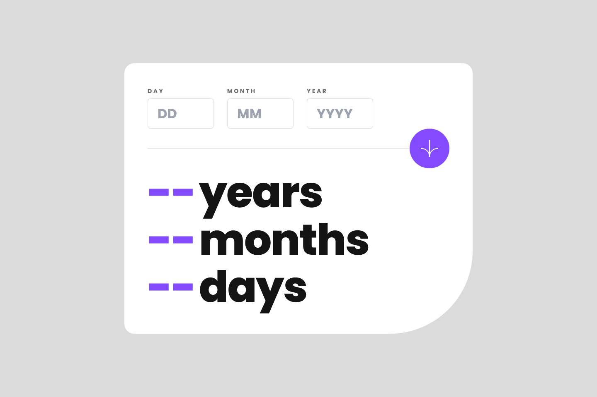

# Frontend Mentor - Age calculator app

# Frontend Mentor - Age calculator app

This is a solution to the [Age calculator app challenge on Frontend Mentor](https://www.frontendmentor.io/challenges/age-calculator-app-dF9DFFpj-Q). Frontend Mentor challenges help you improve your coding skills by building realistic projects.

## Table of contents

- [Overview](#overview)

- [The challenge](#the-challenge)

- [Screenshot](#screenshot)

- [Links](#links)

- [My process](#my-process)

- [Built with](#built-with)

- [Author](#author)

## Overview

### The challenge

Users should be able to:

- View the optimal layout for the interface depending on their device's screen size

- See hover and focus states for all interactive elements on the page

### Screenshot

### Links

- [Solution](https://github.com/beqarion/age-calculator-app)

- [Live Site](https://age-calculator-app-beqarion.netlify.app/)

## My process

### Built with

- Semantic HTML5 markup

- Vanilla JS

- Tailwind CSS

- Vite

- AnimeJS

- Mobile-first workflow

## Author

- Frontend Mentor - [@beqarion](https://www.frontendmentor.io/profile/beqarion)
